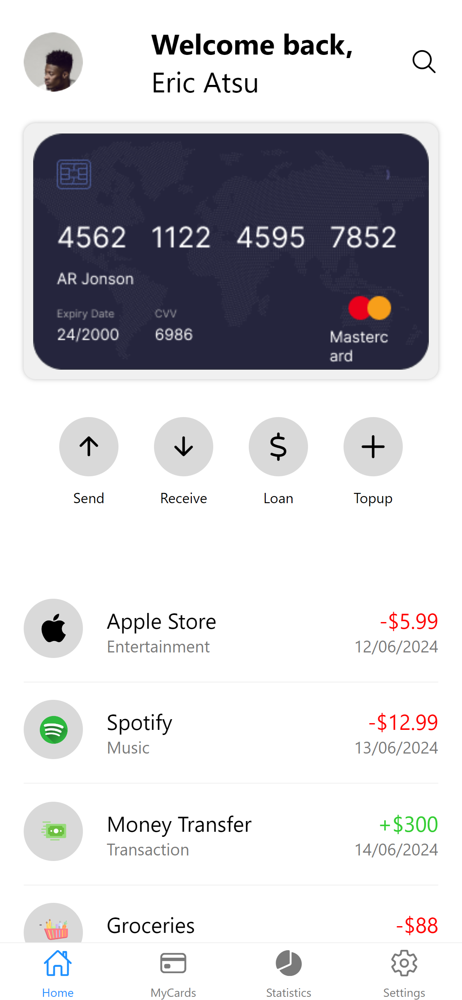

# DCIT202 ASSIGNMENT 5 
### 11046928
## Description
This mobile application is a financial management tool designed to help users manage their finances effectively. The application includes functionalities such as sending and receiving money, taking loans, and topping up balances. It also provides a detailed list of recent transactions. Users can switch between light and dark themes based on their preference.

The application is built using React Native and styled-components. It leverages React Navigation for tab navigation and Expo Icons for icons.

## Components

### HomeScreen Component
The HomeScreen component is the main dashboard where users can see their profile, a summary of their financial activities, and recent transactions. Key features include:
- **Profile Section**: Displays the user's profile picture and a welcome message.
- **Card Section**: Shows an overview of the user's main card.
- **Action Buttons**: Four main actions (Send, Receive, Loan, Topup) are available, each represented by an icon and a label.
- **Transactions List**: A scrollable list of recent transactions, each with details like the title, category, amount, and date.

### SettingsScreen Component
The SettingsScreen component allows users to manage their app settings. Key features include:
- **Change Password**
- **Privacy Policy**
- **Language**
- **Contact Us**
- **My Profile**
- **Theme Switch**

### MyCardsScreen Component
The MyCardsScreen component is a placeholder for future development.

### StatisticsScreen Component
The StatisticsScreen component is another placeholder for future development.

## Screenshots
The following screenshots provide a visual representation of the application in both light and dark themes:

### Screenshots: Light Mode 

### Screenshots: Dark Mode

